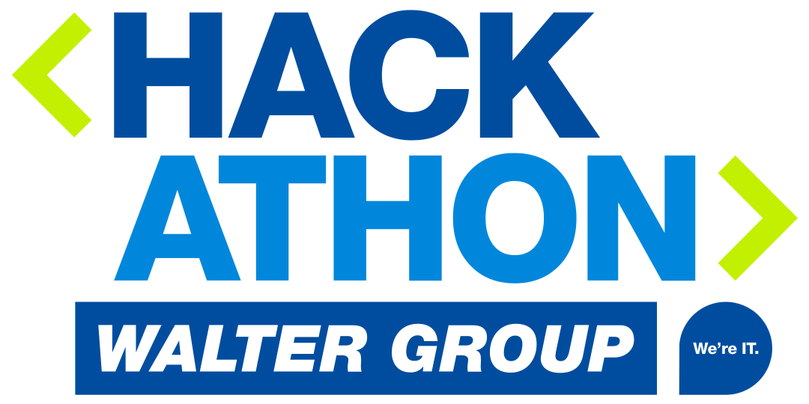

  

  <h4 align="center">This is the <b>Java</b> agent template repository for the  <a href="https://hackathon.walter-group.com" target="_blank">WALTER GROUP Hackathon: Sustainable Logistics</a> which you can use to get started quickly.</h4>

  

    <a href="https://www.walter-group.com"></img></a>
    <a href="https://join.slack.com/t/waltergroup-hackathon/shared_invite/zt-1jdcaqm4z-cMDXcMYG6eHlJaTR5YH0zw"></img></a>
  

**For a detailed explanation of how to make a copy of this repository and get it into the competition build system, please visit [Agent template repositories and competition build system](https://github.com/WALTER-GROUP/hackathon-sustainable-logistics#agent-template-repositories-and-competition-build-system). All questions about the simulation and its rules are answered under [Simulation](https://github.com/WALTER-GROUP/hackathon-sustainable-logistics#simulation).**

## Prerequisites
- **IDE** - We strongly advise you to use an IDE which will help you to edit, compile and run Java code. Our recommendation is IntelliJ IDEA, which you can download for free at: https://www.jetbrains.com/idea/download
- **JDK 17** - You will need a distribution of JDK 17 on your machine. Our recommendation is the Adoptium project, which you can download for free at: https://adoptium.net/

## Where should I add the logic of my truck agent?
- Open the project in your favorite IDE and browse to [src/main/java/com/hackathon/truckagent/TruckAgentController.java](src/main/java/com/hackathon/truckagent/TruckAgentController.java)
- The method `decide` will always be called by the simulation when the next decision is needed from your truck agent. The argument of this method contains all the information you need to decide for the next move. Just return an instance of [DecideRequest](src/main/java/com/hackathon/truckagent/model/DecideRequest.java) and the simulation will take over again.

## How can I test my truck agent?
- Open the project in your favorite IDE and browse to [src/test/java/com/hackathon/truckagent/TruckAgentControllerTests.java](src/test/java/com/hackathon/truckagent/TruckAgentControllerTests.java)
- This is an integration test which will start your agent and will call the `decide` method with the contents of file [src/test/resources/sample_decide_0.json](src/test/resources/sample_decide_0.json)
- You can always change the test and debug your script.
- Also checkout the other sample requests provided.

## How can I run the truck agent or its tests without an IDE?
- `./gradlew clean bootRun` will start the truck agent, which will then service requests on port 8080.
- `./gradlew clean test` will execute all the tests in the project.

## Can I get more information about the model properties?
Sure, check out our [API documentation](https://app.swaggerhub.com/apis-docs/walter-group/walter-group-hackathon-sustainable-logistics/1.0.0) and also thoroughly read our [Simulation documentation](https://github.com/WALTER-GROUP/hackathon-sustainable-logistics#simulation).